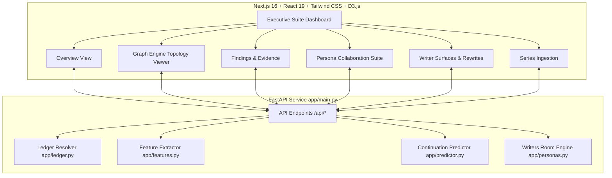
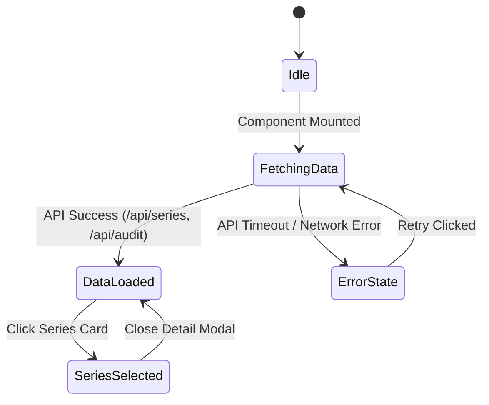
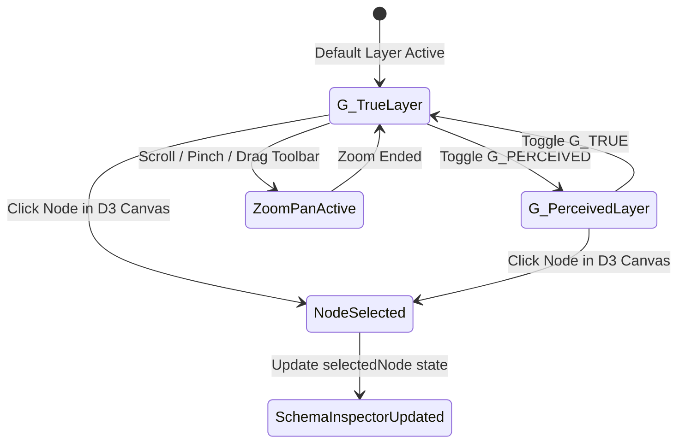
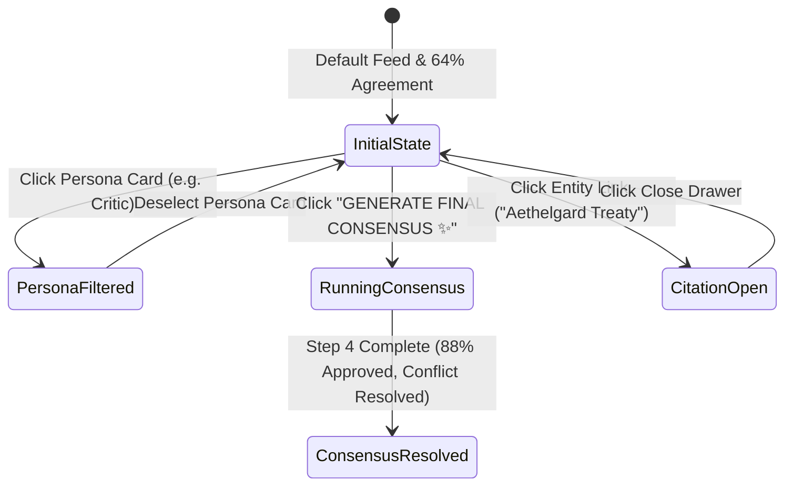
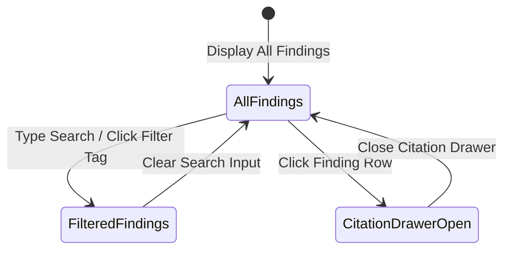
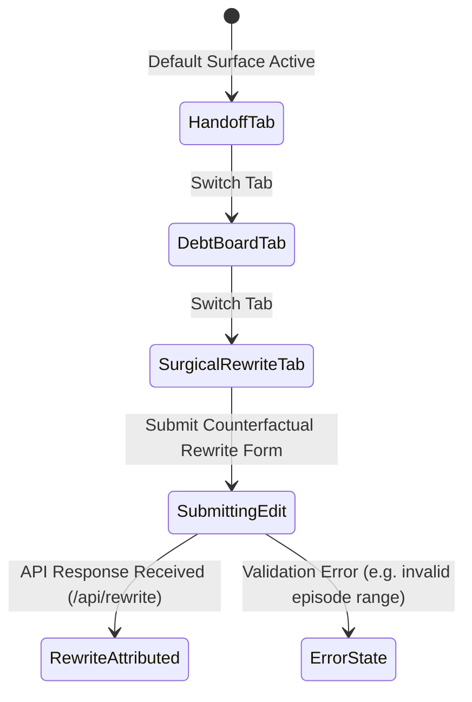
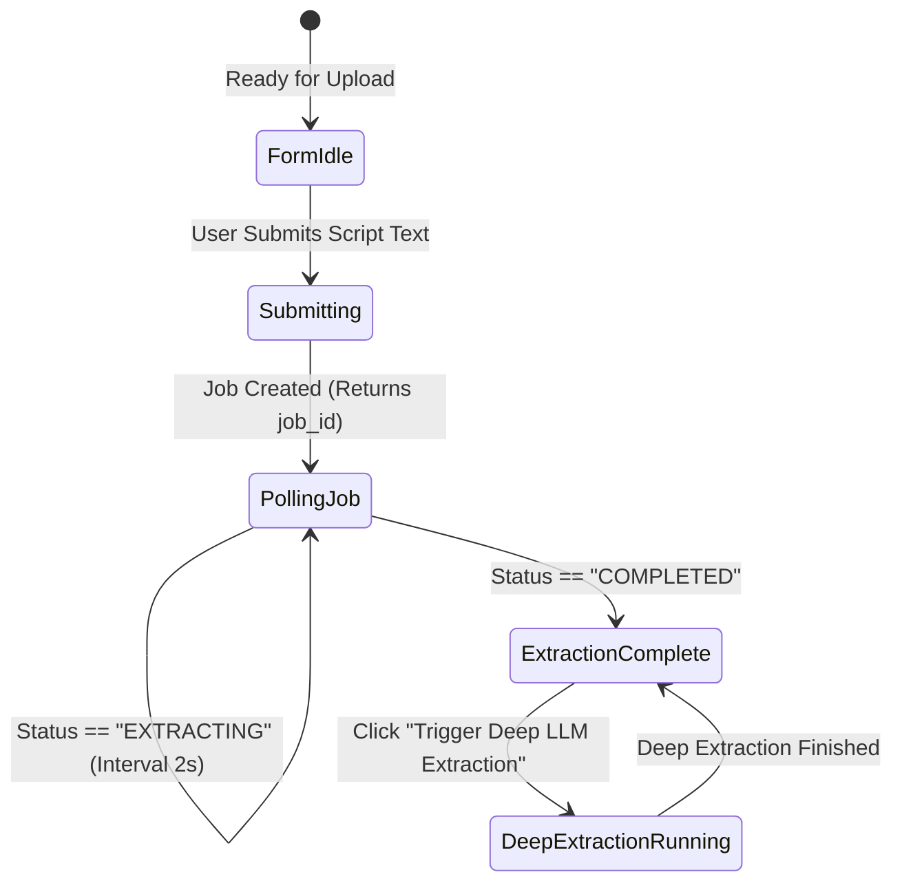

# CanonPulse Executive Suite: Detailed Developer Walkthroughs, State Machines & Data Flow

This document provides an expanded developer-centric guide for **CanonPulse**, detailing every Executive Suite page, its UI state machines, step-by-step execution walkthroughs, core code snippets, and system-wide data flow architecture.

---

## 1. System Architecture Overview

**CanonPulse** combines a deterministic dual-layer narrative graph ledger with machine learning retention forecasting and a multi-agent Writers Room collaboration suite.



---

## 2. Executive Suite Pages: Detailed Walkthroughs & State Machines

---

### Page 1: Overview View (`OverviewView.tsx`)

#### Developer Walkthrough:
1. **Mount & Data Fetching**: On initial mount, `OverviewView` issues parallel `fetch()` requests to `/api/series`, `/api/audit`, and `/api/diagnostics`.
2. **Health Metrics Calculation**: Computes the Narrative Debt Index (NDI) by aggregating overdue claims weighted by episode age.
3. **Portfolio Risk List**: Renders series status badges (`Conflicted`, `Verified`, `Pending`).

#### UI State Machine:



#### Key Component Code Snippet:
```tsx
// OverviewView.tsx - Portfolio NDI & Audit Fetch
const [auditData, setAuditData] = useState<AuditReport | null>(null);

useEffect(() => {
  async function loadOverview() {
    try {
      const res = await fetch("http://127.0.0.1:8000/api/audit");
      if (res.ok) {
        const data = await res.json();
        setAuditData(data);
      }
    } catch (err) {
      console.log("Using committed synthetic fallback data.");
    }
  }
  loadOverview();
}, []);
```

---

### Page 2: Graph Engine Topology Viewer (`GraphEngineView.tsx` & `D3TopologyGraph.tsx`)

#### Developer Walkthrough:
1. **D3 Canvas Initialization**: `D3TopologyGraph` mounts an SVG viewport, setting up D3 force simulation (`d3.forceSimulation()`), link distance forces, and collision radii.
2. **Layer Switching (`G_TRUE` vs `G_PERCEIVED`)**: Toggling between `G_TRUE` (story timeline) and `G_PERCEIVED` (presentation order) updates node links and reheats the D3 simulation (`alpha(0.8).restart()`).
3. **Node Selection & Schema Binding**: Clicking a node in the D3 force graph updates `selectedNode` state, instantly rendering its exact Pydantic schema attributes (`node_id`, `type`, `attributes`, `layer_indices`) inside the **Delta Lake Schema Inspector** JSON panel.
4. **Zoom / Drag Controls**: Handled via `d3.zoom()` supporting wheel scroll, pinch, drag repositioning, and toolbar buttons (+ / - / Reset).

#### UI State Machine:



#### Key Component Code Snippet:
```tsx
// D3TopologyGraph.tsx - Interactive D3 Force Simulation Setup
useEffect(() => {
  if (!svgRef.current) return;
  const svg = d3.select(svgRef.current);
  
  const simulation = d3.forceSimulation<NodeData>(nodes)
    .force("link", d3.forceLink<NodeData, LinkData>(links).id(d => d.id).distance(110))
    .force("charge", d3.forceManyBody().strength(-380))
    .force("center", d3.forceCenter(width / 2, height / 2))
    .force("collision", d3.forceCollide().radius(45));

  simulation.on("tick", () => {
    link.attr("x1", (d: any) => d.source.x).attr("y1", (d: any) => d.source.y)
        .attr("x2", (d: any) => d.target.x).attr("y2", (d: any) => d.target.y);
    node.attr("transform", (d: any) => `translate(${d.x},${d.y})`);
  });
}, [activeLayer]);
```

---

### Page 3: Persona Collaboration: Consensus Review (`PersonaCollaborationView.tsx`)

#### Developer Walkthrough:
1. **Writers Room Data Fetching**: Queries `GET /api/writers-room?use_llm=false|true` to load annotations from 5 AI agent personas (`Director`, `Editor`, `Critic`, `Psychologist`, `Historian`).
2. **Consensus Radar Chart Rendering**: Renders a 5-axis SVG Radar Chart calculating alignment scores across `CORE FANS`, `CASUALS`, `SHIPPERS`, `THEORISTS`, and `CRITICS`.
3. **Consensus Generation Simulation**: Clicking `GENERATE FINAL CONSENSUS ✨` animates multi-agent re-evaluation, expands the radar polygon, updates overall agreement to 88% (`APPROVED`), and resolves active conflicts (`⚡ The Kaelen Pivot`).
4. **Citation Inspection**: Clicking entity terms (`Aethelgard Treaty`) opens an interactive citation detail drawer.

#### UI State Machine:



#### Key Component Code Snippet:
```tsx
// PersonaCollaborationView.tsx - 5-Axis SVG Radar Path Calculation
const getRadarPath = (scores: RadarScore[], radius: number, cx: number, cy: number) => {
  const total = scores.length;
  const points = scores.map((s, i) => {
    const angle = (Math.PI * 2 / total) * i - Math.PI / 2;
    const r = radius * s.value;
    const x = cx + r * Math.cos(angle);
    const y = cy + r * Math.sin(angle);
    return `${x},${y}`;
  });
  return points.join(" ");
};
```

---

### Page 4: Findings & Evidence View (`FindingsEvidenceView.tsx`)

#### Developer Walkthrough:
1. **Audit Findings Ingestion**: Fetches non-paid finding records from `GET /api/audit`.
2. **Defect Filtering & Search**: User types in search bar or selects defect filters (`Plot Hole`, `Overdue Obligation`, `Protected Twist`).
3. **Excerpt Citation Inspection**: Selecting a defect opens the Excerpt Proof Drawer displaying the exact episode line text backing the finding.

#### UI State Machine:



#### Key Component Code Snippet:
```tsx
// FindingsEvidenceView.tsx - Audit Defect Search & Filtering
const filteredItems = auditItems.filter(item => {
  const matchesSearch = item.description.toLowerCase().includes(searchQuery.toLowerCase()) ||
                        item.id.toLowerCase().includes(searchQuery.toLowerCase());
  const matchesType = filterType === "ALL" || item.state === filterType;
  return matchesSearch && matchesType;
});
```

---

### Page 5: Writer Surfaces View (`WriterSurfacesView.tsx`)

#### Developer Walkthrough:
1. **Surface Selection**: Switch between **Writer Handoff**, **Narrative Debt Board**, **Localization Check**, and **Surgical Counterfactual Rewrite**.
2. **Surgical Rewrite Counterfactual**:
   - User inputs `{before_episode, after_episode, edits}`.
   - Posts request to `/api/rewrite`.
   - Backend attributes predicted delta from `ContinuationPredictor` and returns movement decomposed per edit chunk.

#### UI State Machine:



#### Key Component Code Snippet:
```tsx
// WriterSurfacesView.tsx - Surgical Rewrite Counterfactual Submission
const handleRewriteSubmit = async (e: React.FormEvent) => {
  e.preventDefault();
  setIsSubmitting(true);
  const res = await fetch("http://127.0.0.1:8000/api/rewrite", {
    method: "POST",
    headers: { "Content-Type": "application/json" },
    body: JSON.stringify({ before_episode: 26, after_episode: 27, edits: [{ target_feature: "open_obligations", delta: -1 }] }),
  });
  const report = await res.json();
  setRewriteReport(report);
  setIsSubmitting(false);
};
```

---

### Page 6: Series Ingestion View (`SeriesIngestionView.tsx`)

#### Developer Walkthrough:
1. **Script Submission**: User submits raw series text or JSON payload to `/api/submissions`.
2. **Job Status Polling**: System receives `job_id` and polls `/api/submissions/{job_id}` until status transitions from `EXTRACTING` to `COMPLETED`.
3. **Deep Extraction Opt-in**: User can trigger `/api/submissions/{job_id}/deep` for LLM-assisted structural entity extraction.

#### UI State Machine:



#### Key Component Code Snippet:
```tsx
// SeriesIngestionView.tsx - Job Ingestion Polling Loop
const pollStatus = (jobId: string) => {
  const interval = setInterval(async () => {
    const res = await fetch(`http://127.0.0.1:8000/api/submissions/${jobId}`);
    const data = await res.json();
    if (data.status === "COMPLETED") {
      setJobStatus("COMPLETED");
      clearInterval(interval);
    }
  }, 2000);
};
```

---

## 3. End-to-End Execution & Data Mapping Matrix

| Page / Surface | Route / File | Key API Endpoint | State Output |
|---|---|---|---|
| **Overview** | `OverviewView.tsx` | `GET /api/audit`, `/api/series` | Aggregate Narrative Debt Index (NDI), portfolio status counts |
| **Graph Engine** | `GraphEngineView.tsx`, `D3TopologyGraph.tsx` | `GET /api/series` | D3 Force Topology, `selectedNode` attributes, `G_TRUE` vs `G_PERCEIVED` |
| **Persona Collaboration** | `PersonaCollaborationView.tsx` | `GET /api/writers-room` | 5 Agent Annotations, 5-axis Consensus Radar Chart, Showrunner Conflict Resolution |
| **Findings & Evidence** | `FindingsEvidenceView.tsx` | `GET /api/audit`, `/api/discover` | Filtered defect table, proof text excerpts |
| **Writer Surfaces** | `WriterSurfacesView.tsx` | `GET /api/handoff`, `/api/debt-board`, `POST /api/rewrite` | Handoff cards, Narrative Debt Index per writer, edit delta attribution |
| **Series Ingestion** | `SeriesIngestionView.tsx` | `POST /api/submissions`, `/api/submissions/{id}/deep` | Extraction job status (`QUEUED`, `EXTRACTING`, `COMPLETED`) |
